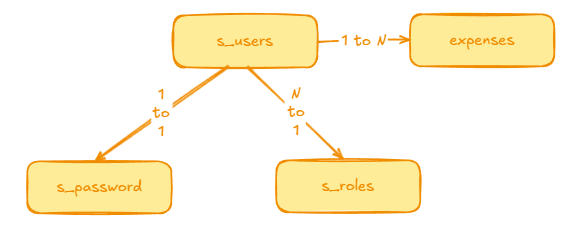

# Expense Tracker

## Schema Database



## Features

| No | Features                                | Auth Requires | Information            |
|----|-----------------------------------------|---------------|------------------------|
| 1  | POST ``/api/v1/auth/register``          | ❌             | Sign up as a new user  |
| 2  | POST ``/api/v1/auth/login``             | ❌             | Login and get JWT      |
| 2  | GET ``/api/v1/users/me``                | ✅             | Take current users     |
| 3  | GET  ``/api/v1/expenses/{idExpense}``   | ✅             | Take detail expenses   |
| 4  | POST ``/api/v1/expenses``               | ✅             | Add new expenses       |
| 5  | GET  ``/api/v1/expenses``               | ✅             | Take all user expenses |
| 6  | PUT  ``/api/v1/expenses/{idExpense}``   | ✅             | Edit user expenses     |
| 7  | DELETE ``/api/v1/expenses/{idExpense}`` | ✅             | Remove user expenses   |
| 8  | GET ``/api/v1/expenses?``               | ✅             |                        |

## How to running this applications

```shell
    docker compose up -d
    
    mvn spring-boot:run
```

## Tech Stack

1. Spring Framework
    - Spring Boot Starter Web
    - Spring Boot Starter Data JPA
    - Spring Boot Starter Validation
    - Spring Boot Starter Security

2. Database
    - Postgresql

3. Migration Tools
    - Flyway

4. JWT
    - jjwt api
    - jjwt jackson
    - jjwt impl

5. Utillities
    - Lombok

[Menerapkan token based autentikasi JWT dalam aplikasi Spring Boot 3](https://medium.com/@tericcabrel/implement-jwt-authentication-in-a-spring-boot-3-application-5839e4fd8fac)