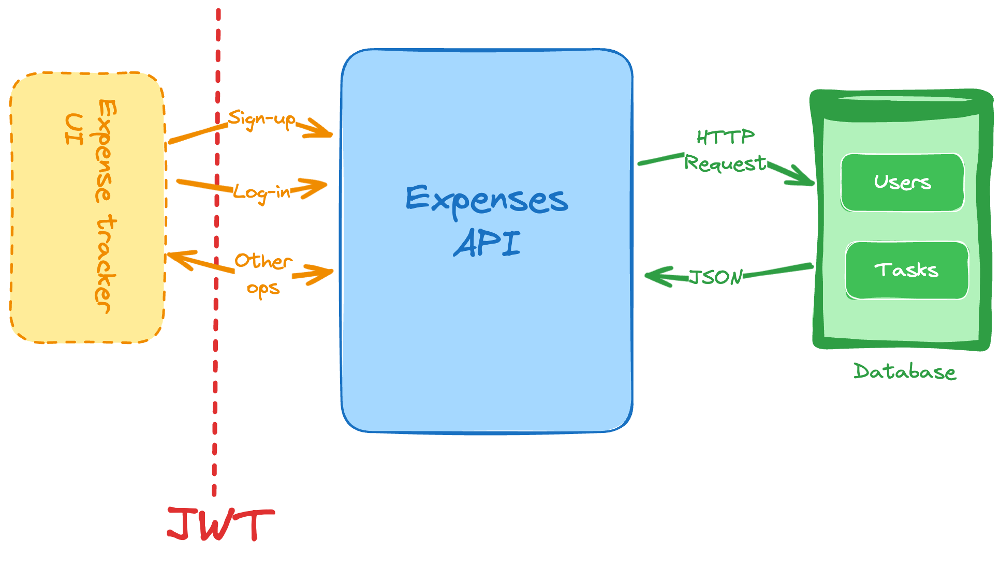

# Expenses Tracker API
This is a API RESTfull for managing expenses tracker.

## Architecture

## Features
Berikut adalah fitur-fitur yang ada di **_Expense Tracker API_**:
- _Registrasi_ untuk pengguna  baru
- _Login_ untuk pengguna, hasilkan dan validasi token _JWT_ untuk menangani _authentication_ dari pengguna.
- Menambahkan pengeluaran baru
- Menghapus pengeluaran yang ada
- Memperbaharui pengeluaran yang ada
- pengguna dapat melihat dan memfilter daftar pengeluaran mereka berdasarkan beberapa kriteria waktu yang berbeda:  
  - Minggu lalu - Filter pengeluaran yang dibuat dalam 7 hari terakhir
  - Bulan lalu - Filter pengeluaran yang dibuat dalam 30 hari terakhir
  - 3 Bulan terakhir - Filter pengeluaran yang dibuat dalam 3 bulan terakhir (90 hari)
  - Kostum - Pengguna bisa memilih sendiri rentang waktu, yaitu dengan menentukan tanggal mulai dan tanggal akhir secara manual

## Tech Stack
- [Golang](https://go.dev/) (programming language)
- [MySQL](https://www.mysql.com/downloads/) (RDBMS)
- [Redis](https://redis.io/docs/latest/) (Database cache)
- [Docker](https://www.docker.com/) (Containerize)

## Framework and Library
- [GoFiber](https://gofiber.io/) (HTTP framework)
- [Logrus](https://github.com/sirupsen/logrus) (Logger)
- [Godotenv](https://github.com/joho/godotenv) (configuration)
- [GORM](https://gorm.io/docs/index.html) (ORM)
- [Golang migrate]() (database migration)
- [Go Playground Validator](https://github.com/go-playground/validator) (Validation)

## Installation
### Run with Docker